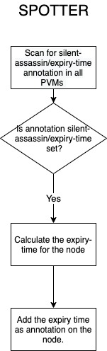
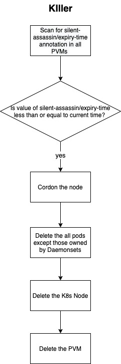
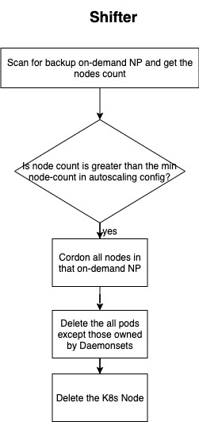
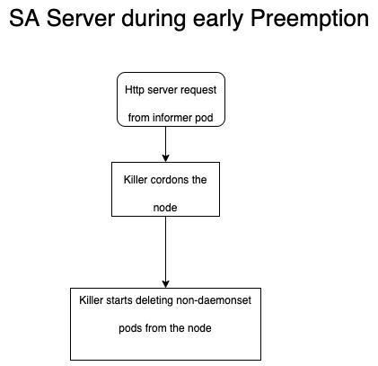

# Architecure
Silent Assassin employs a client server model, where the server is responsible for safely draining and deleting a node and the client for capturing the preemption event.


## Server
The SA server has three components
1) **Spotter**
2) **Killer**
3) **Shifter**
4) **Informer**

### Spotter
The Spotter continuously scans for new PVMs and calculates the expiry time of the PVM such that the PVM will not reach its 24-hours limit and gets terminated during a configured non-business interval of the day. Spotter tries to spread the expiry times of the nodes within that interval as an attempt to avoid large scale disruption. The expiry time is added as an annotation on the node as shown below.

```
 silent-assassin/expiry-time: Mon, 21 Sep 2020 03:14:00 +0530
```



### Killer
The Killer continuously scans preemptible nodes, gets the expiry time of each node by reading the annotation silent-assassin/expiry-time . If the expiry time is less than or equal to the current time, it starts deleting all pods except those owned by DaemonSet running on the node. Once all pods are deleted, it deletes the K8s node and VM.

Initially, we overlooked the fact that GCP does not provide availability guarantees to PVMs. We focussed only on spreading node kill times over an interval to prevent large scale disruptions.



### Shifter
The shifter at configured interval of time, typically off-peak business hours, continuously polls for the backup on-demand node-pools. If the number of nodes in a backup node-pool is more than minimum node-count in its autoscaling configuration then it will shift the workloads to Preemptible node-pool and kill the nodes. Usually, workloads get scheduled in backup node-pools when GCP cannot create new PVMs.


### Informer
The Informer solves the unexpected loss of pods by unanticipated preemption of a PVM. This runs as daemonset pod on each preemptible node, subscribes to preempted value and makes a REST call to SA HTTP Server. SA will start deleting the pods running on that node. As the clean up activity should be performed within 30 seconds after receiving preemption, the server deletes the pods with 30 seconds as the graceful shut down period.




